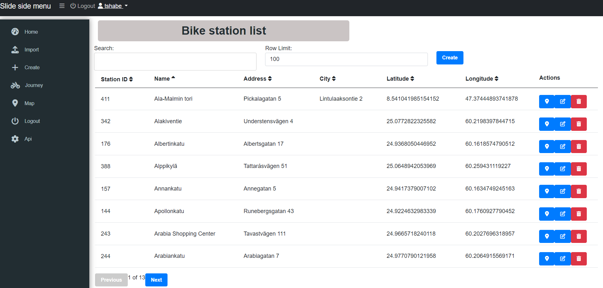
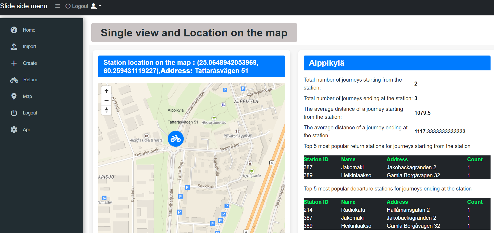
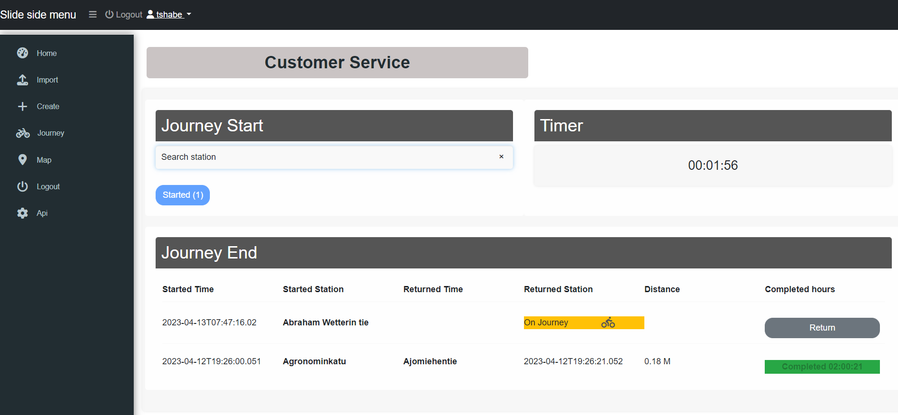
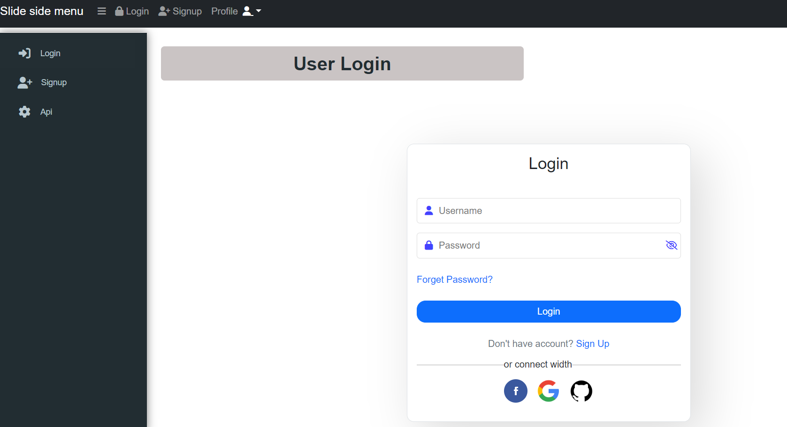

## Helsinki city bike app (Dev Academy pre-assignment solution)
### Description of the Project
A brief description of what this project does and who it's for




Implementation of a web application for displaying data from journeys made with city bikes in the Helsinki Capital area. The backend is implemented using .NET and includes importing data from CSV files to a database, validating data before importing, and filtering imported journeys based on their duration and distance, user authorization with token. The front-end is implemented using Angular and includes a journey list view that import, shows departure and return stations, covered distance, and duration, location on map, customer travel history, customer daily, weekly, monthly, and yearly travel report. Additionally, the frontend includes a station list that shows station information, and a single station view that includes station details and statistics such as the number of journeys starting and ending at the station, the average distance of starting and ending journeys, and the top 5 most popular return and departure stations. The implementation also includes user login authorization using tokens.

This is an application that displays the status of Helsinki city bikes in a web interface. The application retrieves the real-time data from the Helsinki City bike API and shows the status of each bike station on the map.
This is a web application that displays data about journeys made with city bikes in the Helsinki Capital area. The project consists of both a backend service and a frontend UI.

#### Table of Contents

1. [Technologies Used](#technologies-used)
2. [Features](#features)
3. [Prerequisites](#prerequisites)
4. [How to Run the Project](#how-to-run-the-project)
5. [Docker](#docker)
6. [Deploying to Azure](#deploying-to-azure)
7. [Automated Testing](#automated-testing)
8. [Local Testing](#local-testing)
9. [TODO](#todo---todo-)

### Technologies Used
<a name="technologies_used"></a>
The backend service is built using C# and .NET Core, while the frontend is built with Angular and TypeScript. The following libraries and frameworks were used:

#### Backend
1. .NET Core 7.0
2. Entity Framework Core
3. AutoMapper
4. Swagger
5. Moq
6. xUnit
#### Frontend
1. Angular 15
2. Angular Bootstrap
### Features
<a name="features"></a>
The Helsinki City Bike app allows users to view and filter data about journeys made with city bikes in the Helsinki Capital area. The app offers the following features:
* Backend
1. Import data from CSV files to a SQL Server database 
2. Validate imported data before saving 
3. Return a list of all journeys, including departure and return stations, covered distance in kilometers, and duration in minutes 
4. Return a list of all stations, including total number of journeys starting and ending at the station 
5. Return detailed information about a single station, including total number of journeys starting and ending at the station, and the average distance of journeys starting and ending at the station 
6. Allow users to update the return station and return date for a specific journey 
7. Provide Swagger documentation for all API endpoints
* Frontend
1. Import Station and Journey data from CSV files to a SQL Server database 
2. Display a list of all journeys, including departure and return stations, covered distance in kilometers, and duration in minutes 
3. Allow users to sort journeys by any column and filter by date range or station 
4. Display a list of all stations, including total number of journeys starting and ending at the station 
5. Allow users to filter stations by name or location and display station locations on a map 
6. Display detailed information about a single station, including total number of journeys starting and ending at the station, and the average distance of journeys starting and ending at the station 
7. Display charts showing the top 5 most popular departure and return stations for a specific station 
8. Allow users to update the return station and return date for a specific journey
#### Additional: 
1. Creating UI for adding journeys or bicycle stations
2. Single Station location on the map
3. The average distance of a journey starting from the station
4. The average distance of a journey ending at the station
5. Top 5 most popular return stations for journeys starting from the station
6. Top 5 most popular departure stations for journeys ending at the station
7. Ability to filter all the calculations per month
8. Customer dashboard for reading KM and Duration in hour for their past travel
9. Ability to filter top latest journeys history calculations per logged-in user or customer can start or end journey
10. Endpoints to store new journeys data or new bicycle stations
11. Running backend in Docker
12. Running backend in Azure Cloud
13. Implementing automated E2E tests
### Prerequisites 
<a name="prerequisites"></a>
To get started with the Helsinki City Bike app, you will need to have the following software installed on your computer:
1. Visual Studio (with .NET Core 7.0)
2. SQL Server Management Studio (SSMS)
3. Node.js with the latest version
4. Angular CLI with the latest version
### How to Run the Project
<a name="how-to-run-the-project"></a>
##### After installing the prerequisites, you can follow these steps:
1. Clone the project repository to your machine. 
2. Open the terminal and navigate to the project directory. 
3. Run dotnet build to build the backend project. 
4. Navigate to the ClientApp directory and run npm install to install the frontend dependencies. 
5. Run npm start to start the frontend development server. 
6. In a new terminal window, run dotnet run to start the backend server.
#### Docker
<a name="docker"></a>
You can also run the project using Docker. Follow these steps:

1. Clone the project repository to your machine.
2. Open the terminal and navigate to the project directory.
3. Run docker-compose build to build the Docker containers.
4. Run docker-compose up to start the containers.
#### Running the App
<a name="running-the-app"></a>
To run the Helsinki City Bike app, follow these steps:
1. [x] Clone the repository to your local machine 
```bash
git clone https://github.com/maya-tsedeke/Solita-Helsinki-city-bike-app.git
```
1. In SSMS, create a new database named "StationDB" (or any other name of your choosing)
2. In Visual Studio, open the "appsettings.json" file and update the connection string to point to your database 
3. Open a command prompt and navigate to the "Backend" folder of the repository 
4. Run the following commands to create the database schema and seed the database with data:
5. Open a second command prompt and navigate to the "Frontend" folder of the repository 
6. Run the following commands to install the necessary dependencies and start the Angular development server:
```bash
cd Frontend
npm install
npm run build --prod
```
After complete build --prod copy the contents of prod version of the angular frontend from the Frontend/dist/frontend/ and pest and replace it in folder Backend/Backend.Api/wwwroot/ then run the following in your CMD interface
```bash
cd Backend\Backend.Api
dotnet ef database update
dotnet run
```
### Deploying to Azure
<a name="deploying-to-azure"></a>
The project is deployed in an Azure Web App container. You can access the application through the following URL: https://solitawebapp.azurewebsites.net/
#### Automated Azure Deployment
To automate the deployment of this project to Azure Web App, we use GitHub Actions. The workflow file for the deployment is defined in .github/workflows/main_solitawebapp.yml. The workflow is triggered when a commit is pushed to the main branch or when manually triggered.

#### Prerequisites
Before setting up the deployment, make sure you have the following:

An Azure Web App instance with the appropriate app service plan.
An Azure Container Registry instance to host the Docker images.
A publish profile for the Azure Web App.
Docker and Docker Buildx installed on your local machine.
#### Configuration
To configure the deployment, you need to add the following secrets to your GitHub repository:

AzureAppService_PublishProfile_f4feb239a64a458b9dff4a986fce597f: the publishing profile for the Azure Web App.
AzureAppService_ContainerUsername_68d4122fc37d4a5ca5b75edbf6596c3c: the username for the Azure Container Registry.
AzureAppService_ContainerPassword_a1377356b0a74b5da3d9bc0d7fb78165: the password for the Azure Container Registry.
#### Workflow
The workflow consists of three jobs: Backend Test,build and deploy with Frontend product version.
1. [x] The test job runs automated tests for the project using .NET Core.
2. [x] The build job builds the Docker image for the project and pushes it to the Azure Container Registry.
3. [x] The deployment job deploys the Docker image to the Azure Web App. It uses the publishing profile to authenticate with the Azure Web App and the image from the Azure Container Registry. 
#### Some basic workflows included are:
1. checkout: Checks out the code to the runner.
2. setup-dotnet: Installs the .NET Core SDK on the runner. 
3. restore: Restores the dependencies for the .NET Core project. 
4. docker-login: Logs in to
5. [x] To run the workflow, make sure you have the necessary prerequisites and secrets set up, then push a commit to the main branch or manually trigger the workflow.
### Endpoints
The following endpoints are available in the project:

#### Import
1. POST api/Import/Stations: Import the bicycle station data from the dataset into the database.
2. POST api/Import/Journeys: Import the journey data from the datasets into the database.
#### Journey List
1. GET api/JourneyList: List all the journeys in the database.
2. POST api/JourneyList/Add: Add a new journey to the database.
3. PUT api/JourneyList/{journeyId}/return: Update the return info for a journey.
4. GET api/JourneyList/{journeyId}/User: Get the user information for a journey.
5. GET api/JourneyList/{journeyId}: Get the information for a journey.
#### Single View
1. GET api/Singleview/{stationId}: Get the information for a single station, including the number of journeys starting and ending at the station and the average distance of journeys starting and ending at the station.
2. GET api/Singleview/{stationId}?month={month}: Get the information for a single station for a specific month.
#### Station
1. POST api/Station/Create: Create a new station in the database.
2. PUT api/Station/Create/{stationId}: Update the information for a station in the database.
3. GET api/Station/Create/{stationId}: Get the information for a station in the database.
4. DELETE api/Station/Create/{stationId}: Delete a station from the database.
#### Station List
1. GET api/StationList: List all the stations in the database. Limited to 100 rows but can be changeable by user
2. GET api/User: Get the information for the currently authenticated user.
3. POST api/User/authenticate: Authenticate a user and return a JWT token.
4. POST api/User/register: Register a new user.
5. PUT api/User/{userId}: Update the information for a user.
6. GET api/User/{userId}: Get the information for a user.
7. DELETE api/User/{userId
### Automated Testing
<a name="automated-testing"></a>
We have integrated automated testing into our project to ensure code quality and reliability. We have used .NET Core for backend tests and Angular for frontend E2E tests. You can find the backend tests in the Backend.Test folder and frontend tests in the e2e folder.
The test job runs automated tests for the project using 
### Local Testing
<a name="local-testing"></a>
To run the tests locally, follow these instructions:
##### Backend
1. Open a command prompt in the backend folder.
2. Run dotnet test to run the Xunit tests.
```bash
 dotnet test Backend.Test.csproj --configuration Release
 ```
##### Frontend
1. Open a command prompt in the frontend folder.
2. Run ng e2e to run the E2E tests.
```bash
 ng e2e
 ```
### TODO](#todo)
<a name="todo---todo-"></a>
As this project is developed with clean architecture design and repository patterns, we aim to implement SOLID principles to ensure reliability and maintainability. To achieve this goal, we have identified the following areas for improvement:

1. [x] Enhance error handling and validation to provide a more robust and user-friendly experience.
2. [x] Add more tests for edge cases to further enhance the reliability of the project.
3. [x] Continuously improve the project's design and implementation by adhering to SOLID principles.